# Wat is AI?

- **Intelligentie:** "The ability to accomplish complex goals"  
  *(Max Tegmark, Life 3.0: Being Human in the Age of Artificial Intelligenc)*
- **Artificiële Intelligentie:** "Intelligentie vertoond door niet-biologische systemen"

::left::

## Weak AI (Narrow AI)
- Vermogen om een beperkte set doelen te bereiken  
- *Voorbeeld: IBM's Deep Blue (1997)*

::right::

## Strong AI (AGI)
- Vermogen om elke intellectuele taak te begrijpen die een mens kan  
- *"Sparks of AGI: Early experiments with GPT-4"*

<!-- 
  Darko
-->

---
layout: image-right
image: https://www.elcorreo.com/xlsemanal/wp-content/uploads/sites/5/2023/04/alan-turing-inventor-informatica-espia-codigo-enigma-segunda-guerra-mundial.jpg
transition: slide-left
hideInToc: true
---

# Alan Turing (1912-1954)

- **Universal Turing Machine (UTM)**
  - Wiskundige concept van een computer
  - Church-Turing these
- **Halting problem**
  - Er bestaat geen universeel algoritme
- **Enigma-code**
  - Bombe Machine
- **Imitation Game**

<!-- 

-->

<!-- 
  UTM
  - elk modern systeem is hier nog steeds op gebaseerd (behalve quantumcomputers)
  - bewees dat elke UTM een andere UTM kan simuleren

  Halting problem
  - Kan niet voor elk programma bepalen of het stopt of oneindig doorloopt

  Enigma-code
  - Enigma was een cruciale doorbraak die WOII mogelijk heeft bekort

  Imitation Game
  - Test of machines menselijke intelligentie kunnen nabootsen

-->

---
layout: image-left
image: https://images.unsplash.com/photo-1620712943543-bcc4688e7485
transition: slide-left
hideInToc: true
---

# Imitation Game

Een ondervrager probeert te bepalen welke deelnemer een computer is en welke een mens, alleen op basis van geschreven antwoorden

## Setup

- Een ondervrager "C" probeert te bepalen welke deelnemer een computer is ("A" of "B")
- Communicatie gebeurt alleen geschreven

*Verschuift focus van "kan een machine denken?" naar "kan een machine menselijk gedrag imiteren?*

---
layout: iframe-right
url: https://anthay.github.io/eliza.html
transition: slide-left
hideInToc: true
---

# Turing Test vs. Eliza

## Eliza (1966)
- Een van de eerste chatbots
- Expliciete regels en patroonherkenning
- Simuleerde een psychotherapeut

## Verloop
- Zoekt naar sleutelwoorden
- Vooraf gedefinieerde antwoordpatronen
- Stelt vaak vragen terug aan de gebruiker
- Alleen patroonherkenning
- Verrassend effectief

<!-- 
SPEAKER NOTES:
- De Turing Test stelt het criterium dat een machine intelligent is als deze ononderscheidbaar is van een mens in gesprek
- ELIZA toonde aan dat schijnbaar "intelligente" gesprekken kunnen worden gesimuleerd met relatief eenvoudige regels
- ELIZA kon veel mensen misleiden dat ze met een intelligent wezen spraken, wat het "ELIZA-effect" wordt genoemd
- Modern verschil: hedendaagse LLMs zoals GPT gebruiken statistische patronen i.p.v. expliciete regels (neural vs. symbolic AI)
- ELIZA is een voorbeeld van "Symbolic AI" - expliciete kennisrepresentatie via regels en deterministische programmering
- De schijnbare intelligentie van ELIZA toont de kloof tussen menselijke neiging om intentionaliteit toe te schrijven en werkelijk begrip

- De Turing Test stelt het criterium dat een machine intelligent is als deze ononderscheidbaar is van een mens in gesprek
- ELIZA toonde aan dat schijnbaar "intelligente" gesprekken kunnen worden gesimuleerd met relatief eenvoudige regels
- ELIZA kon veel mensen misleiden dat ze met een intelligent wezen spraken, wat het "ELIZA-effect" wordt genoemd
- Modern verschil: hedendaagse LLMs zoals GPT gebruiken statistische patronen i.p.v. expliciete regels (neural vs. symbolic AI)
-->

---
layout: image
image: https://images.nemokennislink.nl/uploads/02_alan_turing_large.jpg
backgroundSize: cover
transition: slide-left
hideInToc: true
---

  

    

      "I believe that at the end of the century the use of words and general educated opinion will have altered so much that one will be able to speak of machines thinking without expecting to be contradicted."
    

    
— Alan Turing

  

<!-- 
  In dit citaat uit 1950 voorspelt Turing dat tegen het einde van de 20e eeuw:
  
  1. Onze definitie van "denken" zou veranderen
  2. We zouden accepteren dat machines kunnen "denken" zonder dat dit controversieel zou zijn
  3. De grens tussen menselijke en kunstmatige intelligentie zou vervagen
-->

---
layout: center
class: text-center
transition: slide-left
hideInToc: true
---

<!--

```mermaid {scale: .9, theme: 'dark'}
flowchart TD
    A["🤖 Artificiële Intelligentie (AI)"] --> B["📊 Machine Learning"]
    B --> C["🧠 Deep Learning"]
    C --> D["✨ Foundation Models & Generatieve AI"]
    
    A1["Machines die intelligent gedrag vertonen"] --- A
    B1["Leren van data zonder expliciete programmering"] --- B
    C1["Neurale netwerken met meerdere lagen"] --- C
    D1["ChatGPT, DALL-E, enz."] --- D
    
    style A fill:#C6B6FF,stroke:#9F89D7,color:black
    style B fill:#9F89D7,stroke:#7B5DC7,color:black
    style C fill:#7B5DC7,stroke:#5A32C8,color:white
    style D fill:#5A32C8,stroke:#4A2BA8,color:white
    
    style A1 fill:none,stroke:none,color:white
    style B1 fill:none,stroke:none,color:white
    style C1 fill:none,stroke:none,color:white
    style D1 fill:none,stroke:none,color:white
```

  Artificiële Intelligentie (AI):
  - Is het overkoepelende concept van machines die intelligent gedrag vertonen
    - Omvat alle technieken om computers "intelligent" te make
  - Bestaat al sinds de jaren 1950, maar heeft recent grote doorbraken gekend Machine Learning:
    - Is een subset van AI waarbij systemen leren van data zonder expliciete programmering
    - Voorbeelden: beslissingsbomen, random forests, support vector machines

  - Traditionele ML vereist vaak handmatige feature-engineering Deep Learning:
    - Is een subset van ML gebaseerd op neurale netwerken met meerdere lagen
    - Kan automatisch features leren uit ruwe data
    - Vereist grote hoeveelheden data en rekenkracht

  - Heeft geleid tot doorbraken in computer vision, NLP en spraakherkenning Foundation Models & Generatieve AI:
    - Foundation models zijn grote modellen getraind op enorme datasets
    - Generatieve AI kan nieuwe content creëren (tekst, afbeeldingen, code)
    - Voorbeelden zijn GPT-4, Claude, DALL-E, Midjourney, GitHub Copilot

  - Deze modellen hebben revolutionaire mogelijkheden maar ook nieuwe uitdagingen De evolutie van AI toont een steeds toenemende complexiteit en capaciteit, waarbij elke nieuwe laag voortbouwt op de voorgaande en nieuwe mogelijkheden introduceert.
-->